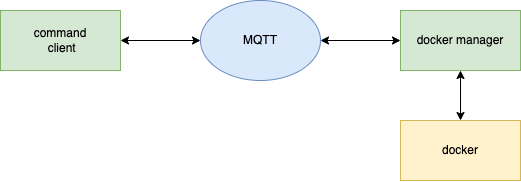

# Hardware Team Golang Assignment

## Intro

In this assignment, you have to manage docker containers using a configuration received from MQTT. Create two clients written in Go, one for sending the configuration to MQTT and another for receiving the configuration and managing the docker containers. Compare the containers running currently with the configuration from MQTT and create/update/delete the containers accordingly. You are free to choose your own design requirements. keep it simple and be creative :)

### Diagram



## Steps

- [ ] Make design requirements
- [ ] Make event model (decide what should be communicated)
- [ ] Create command client to send configuration to mqtt
- [ ] Create docker manager client
  - [ ] Retrieve configurations
  - [ ] Manage docker containers
- [ ] Create a cool feature not listed (Optional)

## Starting up

Install Go from [here](https://go.dev/doc/install)  
Install Docker from [here](https://docs.docker.com/get-started/).

Run the MQTT broker via docker-compose. You can connect to it via `localhost` and port: `1883` by default, no authentication is needed.

```sh
docker-compose up -d
```

To debug MQTT messages [MQTT explorer](https://mqtt-explorer.com/) is a nice tool to view messages in a GUI

## Some useful docs

- [https://pkg.go.dev/github.com/docker/docker/client](https://pkg.go.dev/github.com/docker/docker/client)
- [https://pkg.go.dev/github.com/eclipse/paho.mqtt.golang](https://pkg.go.dev/github.com/eclipse/paho.mqtt.golang)
- [https://github.com/emqx/emqx](https://github.com/emqx/emqx)
- [MQTT specification V3.1.1](https://docs.oasis-open.org/mqtt/mqtt/v3.1.1/os/mqtt-v3.1.1-os.html)
- [MQTT specification V5.0](https://docs.oasis-open.org/mqtt/mqtt/v5.0/cs02/mqtt-v5.0-cs02.html)

## Questions

If you have any questions about the assignment or project setup feel free to contact us at melvin.stans@chargepoint.com. You can also come by the office. We're always ready to help.

Good luck with the assignment!
